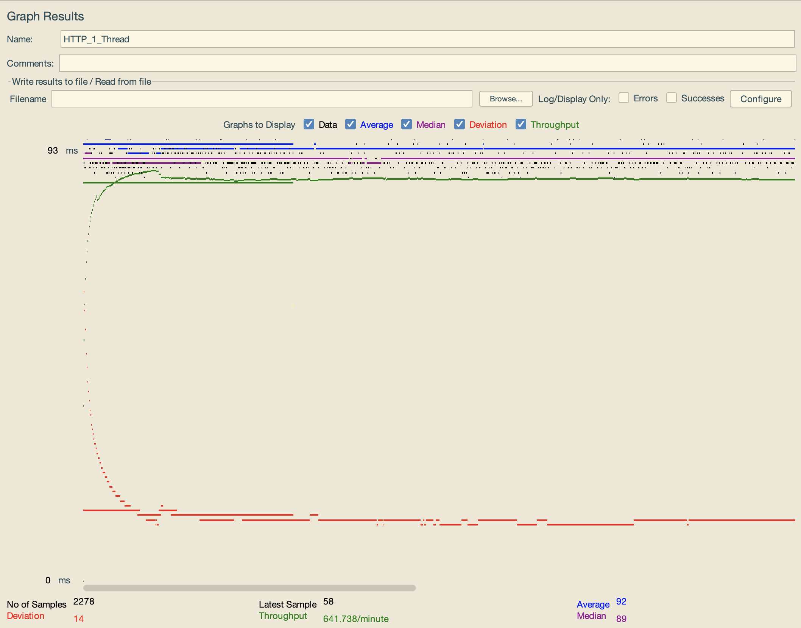
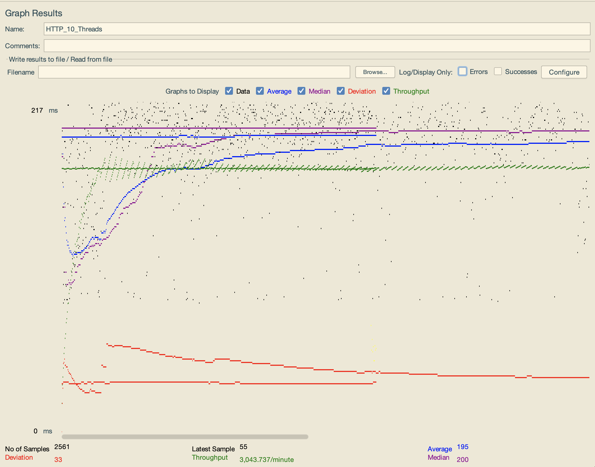
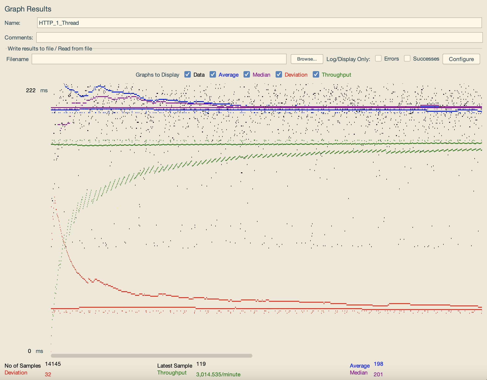
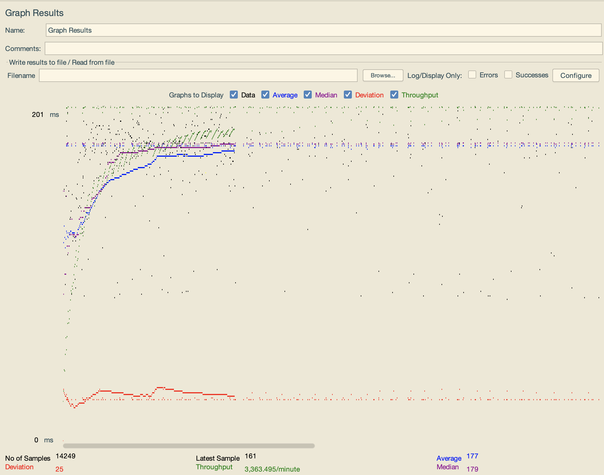
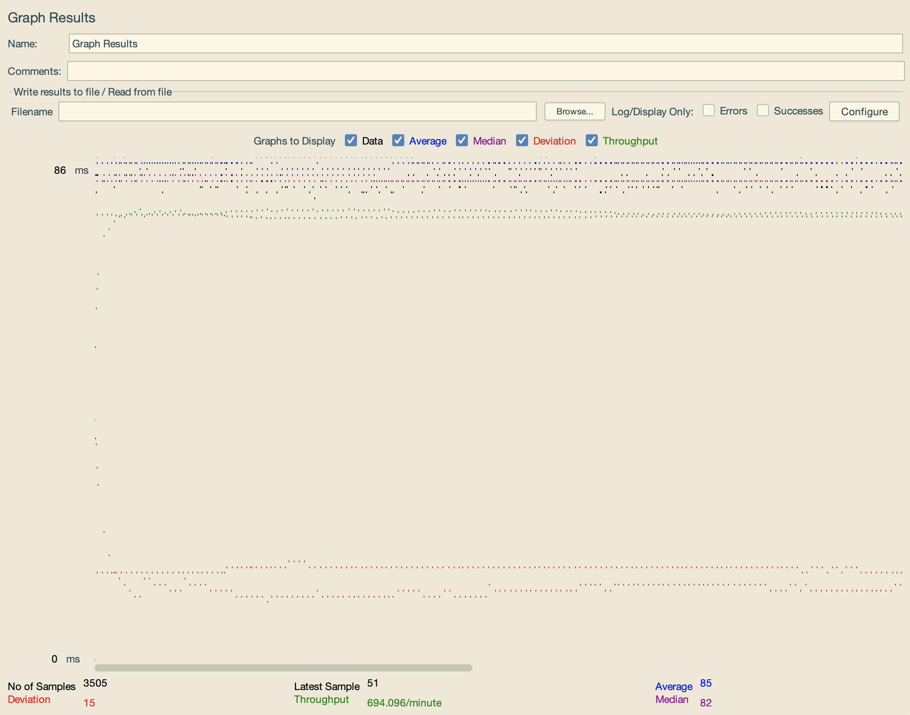
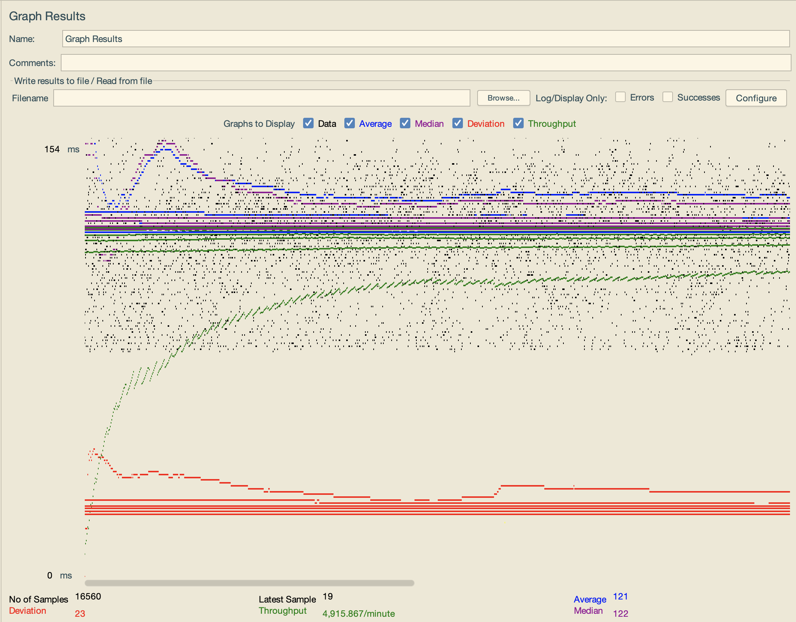
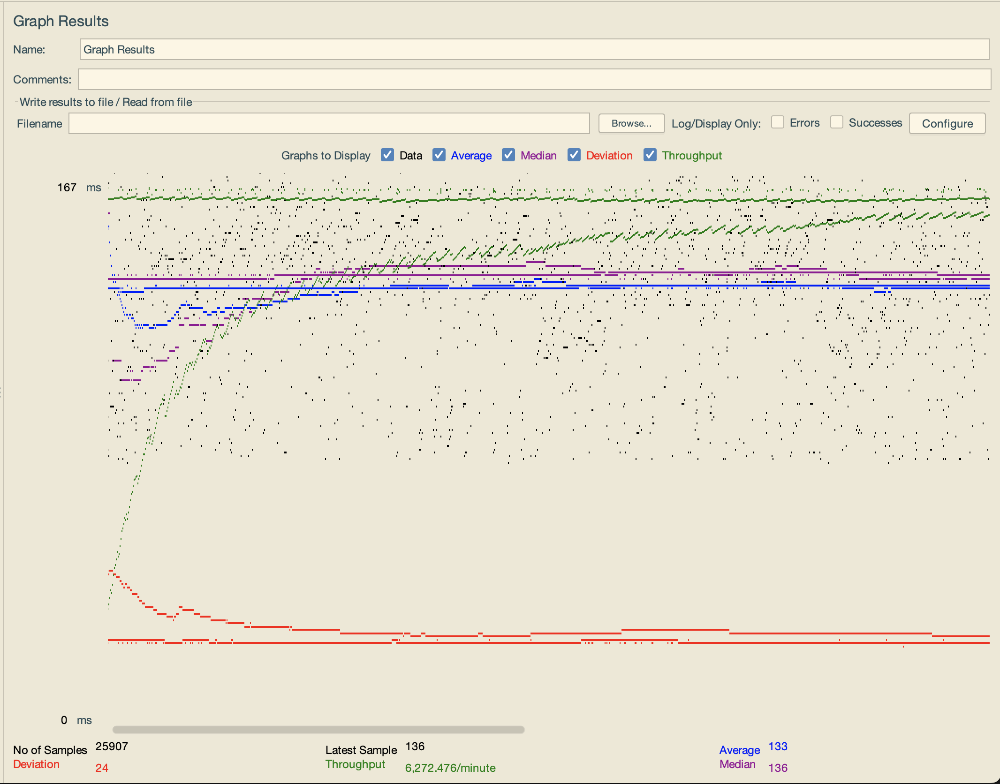

- # General
    - #### Team#: 2023-fall-cs122b-mango
    
    - #### Names: Raymond, Radhakrishna
    
    - #### Project 5 Video Demo Link: [https://drive.google.com/file/d/1S4QXT324b7siZw6OeEe6XEDrIgOODeeu/view?usp=sharing](https://drive.google.com/file/d/1S4QXT324b7siZw6OeEe6XEDrIgOODeeu/view?usp=sharing)

    - #### Instruction of deployment:
    - Clone the above repo, and run the createtable.sql storedprocedures.sql and movie-data.sql then execute the XML parser to parse through all data and store standford movie data onto the mysql database that must be avaialable on your computer. Then run ```mvn pacakge``` to build .war file and test out the website using the format ```http//<ip>:<port>/cs122b-project1-api-example/login.html``` note if you want to go to the load balancer and test our the master-slave replication use the load balancer ip address with the port ```80``` instead of the port ```8080```.

    - #### Collaborations and Work Distribution: Raymond - JMeter time Analysis Task 4 and Fabflix Scaling with LoadBalancer and MySQL; Radhakrishna - JDBC Connection Pooling, Master Slave Replication and LoadBalancer and Internal MySQL configuration


- # Connection Pooling
  
    **Prepared Statement Locations:**
    -  #### project1/src/EmployeeLoginServlet.java
    -  #### project1/src/LoginServlet.java
    -  #### project1/src/MovieAutocomplete.java
    -  #### project1/src/MovieListGenreServlet.java
    -  #### project1/src/MovieListTitleServlet.java
    -  #### project1/src/MovieListSearchServlet.java
    -  #### project1/src/SingleMovieServlet.java
    -  #### project1/src/SingleStarServlet.java

    - #### Connection Pooling Info: /project1/WebContent/META-INF/content.xml
    
    - #### How Connection Pooling Works:
    - Connection pooling optimizes the utilization of connection resources to our MySQL server by efficiently reusing existing connections. This approach minimizes the processing time required for establishing entirely new connections. In our codebase, every servlet utilizing JDBC to interact with the database relies on the resource configuration specified in the context.xml file to establish connections. The content file, located at the specified path, contains details confirming the successful reuse of connections within our application.
    
    - #### How Connection Pooling works with two backend SQL:
    - Connection pooling is implemented efficiently with two backend SQL servers in our setup. Each database has its dedicated connection pool, ensuring that the workload is evenly distributed. When requests are processed through a load balancer, it intelligently directs them to the appropriate server or pool based on the nature of the request. This approach enhances efficiency by distributing the workload across two servers while still benefiting from connection pooling to minimize the creation of new connections. In essence, the load balancer facilitates the reuse of connections within the two backend servers through the utilization of Connection Pool technology. This strategy contributes to improved performance and resource utilization in our database interactions.
    

- # Master/Slave
    - #### Include the filename/path of all code/configuration files in GitHub of routing queries to Master/Slave SQL.
    - /project1/WebContent/META-INF/content.xml
    - /project1/master_content.xml
    - /project1/slave_content.xml

    - #### How read/write requests were routed to Master/Slave SQL:
    - From the load balancer read requests can be sent to either the Master or the Slave, and when received the slave/master servers will use their content.xml to connect to their local database and execute the respective query. However in the instance that write requests are given to the master or the slave the master will continue to go to its local database using a connection from the connection pool if possible and the slave will connect to the master's database using the same concept however it is worth noting that the connection pools are seperate for both servers hence each one must make its own connection independent to the queries being sent to the other server.
    

- # JMeter TS/TJ Time Logs
    - #### Instructions of how to use the `log_processing.*` script to process the JMeter logs:
    - The log processing scrip is located at 2023-fall-cs122b-mango/project1/WebContent/logParser.py
    - It processes the script by reading from the log file and calculating the averages for TS and TJ. To run it we can use python3 logParser.py in the directory to get to the parsed outputs. 


- # JMeter TS/TJ Time Measurement Report

| **Single-instance Version Test Plan**          | **Graph Results Screenshot** | **Average Query Time(ms)** | **Average Search Servlet Time(ms)** | **Average JDBC Time(ms)** | **Analysis** |
|------------------------------------------------|------------------------------|----------------------------|-------------------------------------|---------------------------|--------------|
| Case 1: HTTP/1 thread                          |    | 92                         | 45.7272                             | 45.5265                   | ??           |
| Case 2: HTTP/10 threads                        |    | 195                        | 117.9934                            | 117.8242                  | ??           |
| Case 3: HTTPS/10 threads                       |    | 198                        | 120.1932                            | 119.9562                  | ??           |
| Case 4: HTTP/10 threads/No connection pooling  |    | 177                        | 101.1257                            | 87.0488                   | ??           |

| **Scaled Version Test Plan**                   | **Graph Results Screenshot** | **Average Query Time(ms)** | **Average Search Servlet Time(ms)** | **Average JDBC Time(ms)** | **Analysis** |
|------------------------------------------------|------------------------------|----------------------------|-------------------------------------|---------------------------|--------------|
| Case 1: HTTP/1 thread                          |    | 85                         | 7.4323                              | 7.2043                    | ??           |
| Case 2: HTTP/10 threads                        |    | 121                        | 43.8831                             | 43.5584                   | ??           |
| Case 3: HTTP/10 threads/No connection pooling  |    | 167                        | 56.4047                             | 56.1073                   | ??           |


